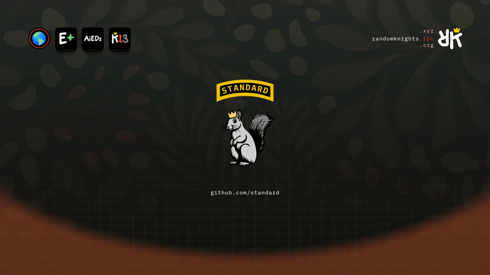

<a name="readme-top"></a>

<!-- HEADER PNG -->
<div align="center">
  <picture>
    
  </picture>

<!-- HERO -->
<h3 align="center" style="color:#ff4124">Random Knights | Standard</h3>

  <p align="center">
    🏫 <a href="https://rand0m.ai">rand0m.ai</a> 2025-2030 🛸 roswell, ga 🍑 <a href="https://randomknights.xyz">ᴚk.xyz</a> + <a href="https://randomknights.llc">ᴚk.llc</a> + <a href="https://randomknights.org">ᴚk.org</a> 🏰
    <br />
    🌝 <a href="https://randomly.engineering">randomly.engineering</a> & <a href="https://knightly.engineering">knightly.engineering</a> 🌚
    <br />
    <br />
    <a href="https://randomknights.xyz"><strong>Read our docs site &raquo;</strong></a>
    <br />
    <br />
    <a href="https://randomknights.xyz/k13/">K13</a>
    &#183;
    <a href="https://randomknights.xyz/aieds/">AiEDs</a>
    &#183;
    <a href="eplus/v1/methodology.md">E+</a>
    &#183;
    <a href="https://standard.rand0m.ai">Artifacts</a>
    &#183;
    <a href="https://github.com/random-knights/standard/issues">Report Bug</a>
    &#183;
    <a href="https://github.com/random-knights/standard/issues">Request Feature</a>
    <br />
    <br />
  </p>
</div>

<!-- HERO GIF -->
<p align="center">
  
</p>

<!-- TITLE -->

## <span style="color:#FAAFA5"><u> **STANDARD** </u></span>

Open standard from Random Knights. K13 is how we write. AiEDs is how
we report modeled energy and carbon from AI work. E+ is how we score
planetary health, and it is a draft.

- Built with:
  - Maximum Effort
  - Rand0m AI Standard : E+ w/ AiEDs & K13
  - Randomly & Knightly . Engineering
  - Node.js &middot; TypeScript &middot; JSON Schema 2020-12 &middot; nvidia-smi &middot; Ollama

<div align="center">

[![ForScience][ForScience]][ForScience-url] [![ForDevs][ForDevs]][ForDevs-url] [![ForQAs][ForQAs]][ForQAs-url]

</div>

K13 and AiEDs are published and free to read. Both are CC BY 4.0, so you can
adopt either without asking. E+ 1.2.0 was ratified on 2026-09-22 and is
published the same way, CC BY 4.0. All three live in this repository.

| Standard                                  | Version                   | License                                              | Canonical text                                                          | Read it                                                                                                        |
| ----------------------------------------- | ------------------------- | ---------------------------------------------------- | ----------------------------------------------------------------------- | -------------------------------------------------------------------------------------------------------------- |
| **AiEDs - AI Energy Disclosure Standard** | methodology 2.3.0         | CC BY 4.0 prose and data, Apache 2.0 code and schema | [spec/methodology.md](spec/methodology.md) with `spec/`, `lib/`, `mcp/` | [standard.rand0m.ai](https://standard.rand0m.ai)                                                               |
| **K13 - AI Response Standard**            | 2.0.0                     | CC BY 4.0 prose, Apache 2.0 reference templates      | [K13.md](K13.md) with `templates/`                                      | [randomknights.xyz/k13](https://randomknights.xyz/k13/)                                                        |
| **E+ - Earth Health Score Methodology**   | 1.2.0, ratified           | CC BY 4.0 prose, Apache 2.0 conformance checker      | [eplus/v1/methodology.md](eplus/v1/methodology.md)                      | [standard.rand0m.ai/eplus/v1/methodology.md](https://standard.rand0m.ai/eplus/v1/methodology.md)               |

<!-- E+ -->

## <span style="color:#ff4124"><u>**E+**</u></span> Earth Health Score Methodology (draft)

A 0 to 100 planetary health index from nine environmental domains. The draft
specifies the weights and normalizers the reference implementation computes,
the coverage-normalized region mean and the exposure-weighted headline, a
provenance ladder under which a document must not claim live for a synthetic
input, a non-averageable breach panel with cited thresholds, and what a
conforming document and a conforming implementation must be able to prove.
It invents nothing: every constant traces to a ratified ADR, the producer
source, the four independent audits of 2026-09-10, or a recorded owner
decision, and the undecided items are listed as open questions.

<!-- K13 -->

## <span style="color:#ff4124"><u>**K13**</u></span> AI Response Standard

Thirteen steps, run in order, every time. Every time does not mean every step
takes real work: on short replies the steps collapse to a second each and the
six passes come out identical. That is the standard being met, not skipped.

Steps 9 to 12 are one ladder. A reader picks a level and the answer is
**written at that level, never rewritten from another one.** All levels state
the same facts and the same figures. If two levels disagree on a number, the
answer is wrong.

<div align="center">
  
| Level                  | Grades    | Step        |
| ---------------------- | --------- | ----------- |
| &#129475; juice box    | K-5       | 9           |
| &#129380; soda pop     | 6-8       | 10          |
| &#129483; energy drink | 9-12      | 11, default |
| &#9749; black coffee   | College   | 12          |
| &#129750; loose leaf   | Masters   | 12.1        |
| &#129481; yerba mate   | Doctorate | 12.2        |

</div> 

All six levels are NORMATIVE as of 2.0.0. Loose leaf and yerba mate were
reserved names in 1.1.0 and are required now, which is why 2.0.0 is a breaking
version: a four-level 1.1.0 report does not conform to it. They are numbered
inside the step 12 drafting block, so the standard is still thirteen steps.

Level three is named "energy drink" and carries the bubble tea glyph. That
mismatch is an intentional owner decision. Do not reconcile one to the other.

### Demo: one fact, written at every level

The same fact about the same feed on the same date. Only the sentences change.
This is the whole claim, so it is worth reading all four rather than one.

> **&#129475; juice box.** The ocean map is old. New data stopped arriving on
> 12 July. The map still draws. It is showing you an average of past years,
> not the water today.

> **&#129380; soda pop.** This map shows ocean currents, the paths that water
> moves along. The data behind it stopped updating on 12 July. Since then the
> map uses a climatology, which is an average worked out from many past years
> rather than a reading taken today. The map still draws, but what it shows is
> that average, not the water as it is now.

> **&#129483; energy drink.** The OSCAR ocean current feed has not refreshed
> since 12 July. With no new data, the renderer falls back to a climatology
> grid: a field of long-term average values for each point on the map,
> computed from years of past observations. The map still renders, and every
> value on it is one of those averages rather than a measurement taken since
> 12 July.

> **&#9749; black coffee.** The OSCAR near-real-time surface current product
> has not refreshed since 12 July. The renderer degrades to the representative
> climatology grid and marks freshness stale, so the field stays fully
> populated while every rendered vector is a climatological mean rather than a
> near-real-time observation. A consumer that treats the surface as current
> will read means as observations.

Every version says the feed stopped on 12 July and that the map now shows an
average. Same fact, same date, four readers.

The interactive version, including the loose leaf and yerba mate levels, is at
[randomknights.xyz/k13/demo](https://randomknights.xyz/k13/demo/).
[Get started](https://randomknights.xyz/k13/get-started/) covers adopting it
in your own pipeline.

<!-- AiEDs -->

## <span style="color:#ff4124"><u>**AiEDs**</u></span> AI Energy Disclosure Standard

An open schema and toolset for self-attested energy and carbon footprint
disclosures for AI models, agents, and apps.

AiEDs surfaces:

- **`/spec`** - the JSON Schema (`aieds.schema.json`) + methodology (`methodology.md`) + conformance examples.
- **`/lib`** - the reference library (TypeScript/Node): **tokens + model in; energy-first disclosure out** (energy modeled from per-model coefficients, carbon derived from energy), byte-mirroring the rand0m.ai app so app and standard agree to the number.
- **`/mcp`** - a keyless MCP server (TypeScript/Node) exposing three tools: `aieds_estimate`, `aieds_factors`, `aieds_disclose`.

> **CURRENT VERSION: methodology 2.2.0 (MCP server 2.0.1). Versions 1.x are
> SUPERSEDED and MUST NOT be implemented.** 1.x specified a flat 0.30 gCO2e per
> 1k tokens for every model and derived energy backward from carbon. Both are
> wrong. If you are new here, implement 2.2.0; do not pick up 1.0.0 because it
> sounds like the stable base. 2.1.0 is clarifying and 2.2.0 is additive, and
> neither changes an existing number, so 2.0.0 and 2.1.0 records remain valid.
> See `spec/methodology.md`.

**Metric hierarchy** (methodology section 1.1): Level 1 modeled scientific estimates (energy, CO2e) -> Level 2 operational metrics (tokens, cost, latency) -> Level 3 human equivalencies (Tree-Time, phone charges, ...; educational only, never offsets).

> **AiEDs scope is device / usage / inference / training.**
> It is NOT the planetary Earth Health Score produced by `rand0m.ai/earthHealthScoreRefresh`. See [spec/methodology.md section 1](spec/methodology.md#1-scope-and-non-overlap).

### Quick start (one minute)

Disclose your first response with the reference library:

```bash
cd lib && npm install && npm run build
node examples/request-to-disclosure.mjs   # request in -> disclosure out
```

Or in your own code (ENERGY-FIRST: pass tokens + model; energy is modeled from
the per-model coefficient and carbon is DERIVED from energy - you never pass
carbon in):

```js
import { disclosureFromResponse } from "@random-knights/aieds-reference";

const d = disclosureFromResponse({
  provider: "GoogleAI",
  model: "gemini-2.0-flash",
  inputTokens: 412,
  outputTokens: 890,
  costUsd: 0.0031,
});
// Real output (run examples/request-to-disclosure.mjs to reproduce):
//   d.energyWh      0.47664            modeled FIRST from gemini's coefficient
//   d.carbonGrams   0.20448            derived: energyWh / 1000 * 429
//                                      429 gCO2e/kWh is the pinned
//                                      response-surface grid intensity
//                                      (methodology 2.4). It is a project
//                                      modeled constant with no external
//                                      citation, labeled as such in
//                                      spec/v2/aieds-factors.json.
//   d.treeTimeLabel "5.1 min"
//   d.provenance    "vendor-published" the per-model rung, never hidden
//   d.confidence    "low"              a token proxy, unless you override it
//   d.citation      "Google (Aug 2025) ... arxiv.org/abs/2508.15734 ..."
```

### Validating a record today

The schema is `spec/aieds.schema.json`, JSON Schema draft 2020-12, methodology
2.2.0. The schema file itself changed in neither 2.1.0 nor 2.2.0.

Its `$id` is `https://standard.rand0m.ai/aieds/v2/aieds.schema.json`, and the
host serves the schema at that URL, byte-identical to `spec/aieds.schema.json`
(a test in `spec/` rebuilds the site tree and refuses a deploy where they
differ). A JSON Schema `$id` is an identifier, not a locator: a schema loaded
from a local file validates just as well, because nothing dereferences it.
Local file validation is the supported path.

So, to validate a record, load the file:

```bash
cd spec && npm install
node examples/validate.mjs          # the bundled fixtures
```

```js
import Ajv2020 from "ajv/dist/2020.js";
import addFormats from "ajv-formats";
import { readFileSync } from "node:fs";

const ajv = new Ajv2020({ strict: false });
addFormats(ajv);
const validate = ajv.compile(
  JSON.parse(readFileSync("spec/aieds.schema.json", "utf-8")),
);

if (!validate(myRecord)) console.error(validate.errors);
```

A record stamping a 1.x `methodologyVersion` is REJECTED. Methodology 1.x is
superseded and must not be used for new disclosures, so a v2 schema that accepted
a v1 record would be certifying nonconformance. The `deprecated-v1-*.json`
fixtures exist to prove that rejection, not to be copied.

`provenance` is optional. It carries the section 5.1 ladder and says where the
FACTOR came from. `confidence` carries the section 5 ladder, which says how the
ENERGY figure was arrived at, and defaults to `low` for any token-proxy method.
They are different ladders and neither implies the other, which is why they are
separate fields rather than one widened one.

Methodology 2.2.0 states the provenance ladder as `measured`,
`vendor-published`, `class-estimated`, `synthetic`, `unknown`, strongest first.
The schema enum still carries only the first three and the last: `synthetic` is
normative prose from 2.1.0 onward and a proposed addition to a FUTURE schema
revision, which methodology 2.2.0 did not make, so a machine-validated record
cannot stamp it yet. A producer with a generated input
stamps the nearest rung the schema carries and says in prose that the input was
generated.

The rest of the toolset:

```bash
# Validate the bundled examples against the schema:
cd spec && npm install && node examples/validate.mjs

# Build and test the MCP server:
cd mcp && npm install && npm run build && npm test

# Wire the MCP server into your agent (stdio):
node mcp/dist/index.js
```

### What AiEDs is

Energy and carbon transparency for AI is fragmented: model cards use ad-hoc fields, EU AI Act compliance requires documented energy figures, and agent frameworks have no standard way to surface per-session footprint.

AiEDs provides:

1. **A schema** (`aieds.schema.json`, JSON Schema draft 2020-12) that is field-compatible with Hugging Face `co2_eq_emissions` and the EU AI Act model-documentation form - so a single disclosure is legible to both.
2. **A methodology** (`methodology.md`) with versioned factor tables (hardware TDP, grid intensity, token proxies) and a governance rule: no silent drift (owner-ratified changes, CHANGELOG).
3. **An MCP server** that any agent can wire in to get `aieds_estimate` / `aieds_factors` / `aieds_disclose` over stdio - keyless, deterministic, zero network calls.

### Why 2.0.0 (energy-first) beats 1.x

1.x used a single flat constant - **0.30 gCO2e per 1k tokens for every model** - and derived energy backward from carbon. That is what 2.0.0 abolishes. The response-surface path (methodology 2.4, implemented in `/lib`) replaces it with:

- **Per-model energy coefficients, not one constant.** Each model class has its own `whPer1kIn` / `whPer1kOut` (output tokens cost ~4x input: decode is sequential, prefill is parallel). Gemini `0.12 / 0.48`, GPT/o\* `0.17 / 0.68`, Claude `0.145 / 0.58` Wh per 1k tokens, plus a per-provider PUE.
- **Confidence tiers on every coefficient**, surfaced in the disclosure, never hidden:

<div align="center">
  
  | tier               | meaning                                                          |
  | ------------------ | ---------------------------------------------------------------- |
  | `measured`         | we benchmarked it                                                |
  | `vendor-published` | the provider published a figure (cited; split assumptions noted) |
  | `class-estimated`  | inferred from model class; no provider figure exists             |
  | `unknown`          | nothing sourceable; frontier-class fallback, labeled `unknown`   |

<\div>
  
- **A sourced citation per coefficient** (the honesty contract: a number without provenance does not belong in the table). Gemini cites Google Aug 2025 (arXiv:2508.15734); GPT cites the OpenAI Jun 2025 blog figure; Claude states plainly it is a class estimate (no Anthropic figure as of 2026-01); an unlisted model returns the frontier-class fallback labeled `unknown` rather than a confident guess.

Concretely: the same 412-in / 890-out exchange that 1.x would have blurred into one flat number now discloses `0.47664 Wh` energy-first with a `vendor-published` tier and a citation for Gemini, versus `0.691128 Wh` labeled `unknown` for a model not in the table - the reader can see both the number and how much to trust it.

<!-- The AiEDs section below is GENERATED and reports the energy of developing
     THIS repository. Everything between AIEDS:BEGIN and AIEDS:END is written
     by the AiEDs README generator from the SessionEnd ledgers and placed here
     by scripts/sync-aieds.mjs in random-knights/.github. Do not hand edit it:
     this repository publishes the methodology, so a typed figure here would be
     the standard failing its own honesty contract. The AiEDs block workflow
     fails a README whose block has drifted. -->

<!-- AIEDS:BEGIN -->

<div align="center">

## <span style="color:#FF4124"> **Ai Energy Disclosure Standard** </span> ( <span style="color:#FAAFA5"><small> **AiEDs v2.2.0** </small></span> )

### 🌎 <span style="color:#EDC303"> Total **AiEDs** Usage | standard </span> 🏰

<table>
<tr>
<td align="center" width="25%">

⚡<br>
<b>12.6</b><br>
<sub>kWh</sub>

</td>
<td align="center" width="25%">

🌫️<br>
<b>5.4</b><br>
<sub>kg CO₂e</sub>

</td>
<td align="center" width="25%">

🌳<br>
<sub>Tree-Time</sub><br>
<b>94</b><br>
<sub>days</sub>

</td>
<td align="center" width="25%">

🔢<br>
<b>71.84 M</b><br>
<sub>tokens, 13 sessions</sub>

</td>
</tr>
</table>

<sub>Tree-Time is the time one mature tree (two or more years of growth) needs to capture this carbon at its yearly rate, 21 kg CO₂e per year; shown in days.</sub>

**The figures above are the AiEDs impact of developing this repository,**
measured by a `SessionEnd` hook on the developers' machines and reported under AiEDs section 2.4.1,<br>
which counts plain input, cache-creation and cache-read tokens all as input at the input coefficient.<br>
<sub>97.5 percent of our input is cache reads, so that rule decides the answer by 7.6x.
Weighting a cache read at 0.1 instead gives <b>1.7 kWh, 0.7 kg CO₂e, 12 days of Tree-Time</b>.
That lower figure is <b>a local departure from the standard, not a reading of it</b>. It is
published because it is what this project offsets against.
</sub>

<details>
<summary><b>Equivalencies</b></summary>

<sub>The same educational comparisons the rand0m.ai app renders, from the same constants. Educational comparisons, not measurements.</sub>

| Equivalent | Amount | Basis |
| --- | ---: | --- |
| Phone charges | 1,051 | 12 Wh per charge |
| LED bulb hours | 1,261 | 10 W bulb |
| Laptop hours | 252 | 50 W laptop |
| Driving distance | 32 km | 170 g CO₂e per km |
| Tree-Time | 94 days | 21 kg CO₂e per mature tree per year |

</details>

<details>
<summary><b>Offset</b></summary>

<sub>What the figures above cost, and what it would take to absorb them. Modeled, like everything else here.</sub>

**Energy cost: USD 2.31.** 12.6 kWh at USD 0.1834 per kWh, the United States average residential price for June 2026 (18.34 cents per kilowatthour), from <a href="https://www.eia.gov/electricity/monthly/epm_table_grapher.php?t=epmt_5_3">U.S. Energy Information Administration, Electric Power Monthly, Table 5.3</a>. The rate is pinned, not looked up at render time, so this figure is reproducible.

**Modeled provider spend: USD 30.05.** The same sessions priced at published API list prices, rates version 2026-09-01, with cache writes at 1.25x and cache reads at 0.1x an input token. It is a MODEL, not a bill: this work runs on a subscription, so the marginal cost was nothing. It covers the 8 of 13 sessions counted above whose model that file prices; the other 5 carry a model nobody has priced and add nothing, rather than an assumed rate.

**Trees needed: 1.** 5.4 kg CO₂e divided by 21 kg CO₂e, the yearly capture of one mature tree, rounded up: 1 mature tree would absorb this carbon within one year. Put the other way round, that is the Tree-Time above: one mature tree working for 94 days.

**Offset cost: USD 0.03.** 0.0 tonnes of CO₂e at USD 6.03 per tonne, the REDD+ (Reduced Emissions from Deforestation and Degradation in Developing Countries) average, 2024, <a href="https://www.ecosystemmarketplace.com/publications/2025-state-of-the-voluntary-carbon-market-sovcm/">Ecosystem Marketplace, State of the Voluntary Carbon Market 2025, Table 4</a>. That is a nature-based avoidance and protection, not removals average: this project prices itself against keeping land, animals and trees standing, never against carbon removals or industrial and household offsets. Buying an offset is not the same as not spending the energy, and this line does not claim otherwise.

</details>

<sub>
<a href="https://standard.rand0m.ai/aieds/v2/methodology.md">AiEDs Methodology v2.2.0</a>
by <a href="https://standard.rand0m.ai">Random Knights, LLC</a> (ORCID 0009-0006-5066-1693),
<a href="https://creativecommons.org/licenses/by/4.0/">CC BY 4.0</a>
· `claude` coefficients are <code>class-estimated</code>, the second-weakest provenance tier
· grid 429 gCO₂e/kWh pinned
· measured by a `SessionEnd` hook, not modeled from a guess<br>
Energy and carbon are modeled estimates. Tree-Time and equivalents are educational comparisons.
</sub>

<sub>Measured by a <code>SessionEnd</code> hook on one developer machine; a second machine's ledger is not yet merged in, over 293 recorded sessions covering 2026-07-27 to 2026-09-13, which is every session the hook recorded and no session it did not. Two attribution bases are published: BY LANE LEDGER in the table above, and BY WORKING DIRECTORY, the stricter view, in <code>aieds-readme.json</code>. The organization totals are the same under both. Both bases are DATE AWARE: the application repository was named <code>xyz</code> until 2026-08-19 and is named <code>ruok</code> now, so a row written before that day is placed on the repository the name meant then. Any offset figure is a nature-based average, not removals. Generated, never hand-typed.</sub>

</div>

<!-- AIEDS:END -->

<!-- ARCHITECTURE -->

## <span style="color:#555555"><u>**ARCHITECTURE**</u></span> (ADR 0010)

AiEDs is specified in an owner-ratified architecture decision record. The key design choices:

- **Self-attestation** - producers derive and sign their own disclosures; consumers verify schema conformance. No registry or central authority.
- **Methodology versioning** - `methodologyVersion` in every disclosure ties the number to a specific factor table snapshot. An auditor can replay the math.
- **Agent-native** - the MCP tool interface means an agent can disclose its own session footprint inline, not as a post-hoc batch job.
- **Keyless** - the schema and MCP server require no API keys, no auth, no secrets.

<!-- SURFACES -->

## <span style="color:#555555"><u> **SURFACES** </u></span>

| Surface              | Path                         | License    | Description                                                                                                                                                  |
| -------------------- | ---------------------------- | ---------- | ------------------------------------------------------------------------------------------------------------------------------------------------------------ |
| Schema               | `spec/aieds.schema.json`     | Apache 2.0 | JSON Schema 2020-12 for one disclosure                                                                                                                       |
| Methodology          | `spec/methodology.md`        | CC BY 4.0  | 2.2.0: energy-first path + per-model coefficients + factor tables + the provenance ladder + two-term measured device coefficients                            |
| Coefficient tables   | `spec/v2/aieds-factors.json` | CC BY 4.0  | The published factor data every surface reads                                                                                                                |
| Measurements         | `spec/measurements/`         | CC BY 4.0  | Measurement harnesses (their code is Apache 2.0), method documents and raw power samples. EVIDENCE, not coefficients: nothing here is in a factor table unless a factor table cites it. |
| Examples             | `spec/examples/`             | CC BY 4.0  | 4 valid disclosures, 3 superseded-1.x records the schema must reject, and a conformance script                                                               |
| Reference library    | `lib/`                       | Apache 2.0 | Energy-first disclosures: per-model coefficients + provenance + citations (mirrors the rand0m.ai app; contract-tested)                                       |
| MCP server           | `mcp/`                       | Apache 2.0 | TypeScript Node MCP: estimate / factors / disclose                                                                                                           |
| K13                  | `K13.md`                     | CC BY 4.0  | K13 - AI Response Standard, 2.0.0. The canonical text.                                                                                                       |
| K13 report templates | `templates/`                 | Apache 2.0 | Reference markdown and HTML report templates. One rendering of the K13.md section list, not the requirement.                                                 |
| E+                   | `eplus/v1/methodology.md`    | CC BY 4.0  | E+ - Earth Health Score Methodology, 1.2.0, ratified 2026-09-22. The canonical text, including the public implementation changelog.                          |

<!-- ROADMAP -->

## <span style="color:#555555"><u> **ROADMAP** </u></span>

### Shipped (this repo)

- [x] `aieds.schema.json` (JSON Schema draft 2020-12)
- [x] `methodology.md` 2.2.0 (energy-first; per-model coefficients + the provenance ladder + two-term measured device coefficients + citations) with factor tables + governance
- [x] 7 conformance examples (4 valid, 3 superseded-1.x rejection cases) + validate script
- [x] MCP server 2.0.0: `aieds_estimate`, `aieds_factors`, `aieds_disclose`
- [x] Reference library 2.1.0: energy-first, byte-mirrors the app, emits provenance + confidence
- [x] CI: schema validation + build + unit tests

### Deferred

- [ ] Read API / SDK for ingesting disclosures from external producers
- [ ] `.well-known/aieds.json` auto-discovery endpoint
- [ ] npm publish `@random-knights/aieds-mcp`
- [ ] Scope 3 embodied carbon (hardware manufacture)
- [ ] Real-time grid intensity (carbon-aware scheduling)

<!-- OPERATING -->

## <span style="color:#555555"><u> **OPERATING** </u></span>

- [CONTRIBUTING.md](CONTRIBUTING.md) - contributors and agents: what belongs
  where, versioning and governance, the keyless rule, and how to deploy the
  site.

<!-- CITATION -->

## <span style="color:#555555"><u> **CITATION** </u></span>

Cite the version you implemented or adopted. AiEDs versions are not
interchangeable: 1.x derived energy backward from carbon and 2.0.0 models
energy first, so a citation without a version does not say which numbers were
used.

> Random Knights, LLC (2026). AiEDs - AI Energy Disclosure Standard,
> version 2.2.0. CC BY 4.0. https://standard.rand0m.ai

> Random Knights, LLC (2026). K13 - AI Response Standard, version 2.0.0.
> CC BY 4.0. https://github.com/random-knights/standard

E+ is a draft and has no citable ratified version yet. Cite the draft only as
a draft:

> Random Knights, LLC (2026). E+ - Earth Health Score Methodology, version
> 1.0.0 (draft, not ratified). CC BY 4.0.
> https://github.com/random-knights/standard

**Author:** Random Knights, LLC, ORCID https://orcid.org/0009-0006-5066-1693

Machine-readable metadata: [CITATION.cff](CITATION.cff) describes AiEDs and
is the file GitHub reads to offer APA and BibTeX exports from the sidebar;
[CITATION.k13.cff](CITATION.k13.cff) describes K13 in the same format;
[CITATION.eplus.cff](CITATION.eplus.cff) describes the E+ draft.

<!-- LICENSE -->

## <span style="color:#555555"><u> **LICENSE** </u></span>

Two licenses, split by what a path IS, not by which directory it sits in.
Code and the schema (so implementers can vendor them without attribution
friction) are Apache 2.0. Text and data that document or parameterize the
standard (so attribution survives forks and citation stays intact) are
CC BY 4.0.

<div align="center">
  
| Path                                      | License                   |
| ----------------------------------------- | ------------------------- |
| `lib/`                                    | [Apache 2.0](LICENSE)     |
| `mcp/` (code)                             | [Apache 2.0](LICENSE)     |
| `spec/aieds.schema.json`                  | [Apache 2.0](LICENSE)     |
| `spec/examples/validate.mjs`              | [Apache 2.0](LICENSE)     |
| `spec/test/`                              | [Apache 2.0](LICENSE)     |
| `spec/measurements/*/harness/`            | [Apache 2.0](LICENSE)     |
| `eplus/v1/conformance/` (code)            | [Apache 2.0](LICENSE)     |
| `templates/`                              | [Apache 2.0](LICENSE)     |
| `scripts/`, `.github/`                    | [Apache 2.0](LICENSE)     |
| `packages/` (manifests and code)          | [Apache 2.0](LICENSE)     |
| `K13.md`                                  | [CC BY 4.0](LICENSE-DOCS) |
| `spec/methodology.md`                     | [CC BY 4.0](LICENSE-DOCS) |
| `spec/v2/aieds-factors.json`              | [CC BY 4.0](LICENSE-DOCS) |
| `spec/v2/standard-versions.json`          | [CC BY 4.0](LICENSE-DOCS) |
| `spec/examples/*.json`                    | [CC BY 4.0](LICENSE-DOCS) |
| `spec/measurements/` (not `harness/`)     | [CC BY 4.0](LICENSE-DOCS) |
| `eplus/v1/methodology.md`                 | [CC BY 4.0](LICENSE-DOCS) |
| READMEs, `CONTRIBUTING.md`, `docs/`       | [CC BY 4.0](LICENSE-DOCS) |

<\div>

The K13 report templates are the clearest case of that split. `templates/` is a
reference implementation, so it is Apache 2.0 and forkable without attribution
friction. The REQUIREMENT those files render, the ordered section list in
K13.md under "The report template", is specification text and stays CC BY 4.0.
Fork the markup freely; cite the standard.

A file not in the table follows the same split: code is Apache 2.0, prose and
data are CC BY 4.0. The two npm packages built from this repository,
`@randomknights/aieds` and `@randomknights/k13`, each carry both licenses and
declare `Apache-2.0 AND CC-BY-4.0`; [NOTICE](NOTICE) says which part of each
is which. Nothing in this repository is third-party material under another
license.

See [LICENSE](LICENSE), [LICENSE-DOCS](LICENSE-DOCS) and [NOTICE](NOTICE) for
full terms.

<!----------- BADGES ----------->

<!-- TECHNOLOGY -->

## <span style="color:#555555"><u> **TECHNOLOGY** </u></span>

<!-- ### **Workspace**

[![Windows][Windows]][Windows-url]
[![Nvidia][Nvidia]][Nvidia-url]
[![Ryzen][Ryzen]][Ryzen-url] -->

### **CLI**

[![GitBash][GitBash]][GitBash-url]
[![Herdr][Herdr]][Herdr-url]
[![Powershell][Powershell]][Powershell-url]

### **IDE**

[![VSCode][VSCode]][VSCode-url]

### **Source Control**

[![GitHub][GitHub]][GitHub-url]
[![Git][Git]][Git-url]

### **Database**

[![HiveDB][HiveDB]][HiveDB-url]
[![MongoDB][MongoDB]][MongoDB-url]
[![PostgreSQL][PostgreSQL]][PostgreSQL-url]

### **Tools**

[![AdobeAudition][AdobeAudition]][AdobeAudition-url]
[![AdobePodcast][AdobePodcast]][AdobePodcast-url]
[![TeenageEngineeringMic][TeenageEngineeringMic]][TeenageEngineeringMic-url]
[![NothingHeadphones][NothingHeadphones]][NothingHeadphones-url]
[![RaspberryPi][RaspberryPi]][RaspberryPi-url]

### **Development**

[![Node.js][Node.js]][Node-url]
[![Python][Python]][Python-url]
[![JavaScript][JavaScript]][JavaScript-url]
[![TypeScript][TypeScript]][TypeScript-url]
[![Flutter][Flutter]][Flutter-url]
[![Dart][Dart]][Dart-url]

### **Testing**

[![Chai.js][Chai.js]][Chai-url]
[![Cucumber][Cucumber]][Cucumber-url]
[![Cypress.js][Cypress.js]][Cypress-url]
[![Jest][Jest]][Jest-url]
[![Lighthouse][Lighthouse]][Lighthouse-url]
[![Mocha.js][Mocha.js]][Mocha-url]
[![Swagger.js][Swagger.js]][Swagger-url]
[![TestLibrary][TestLibrary]][TestLibrary-url]

### **AI**

[![OpenAI][OpenAI]][OpenAI-url]
[![Gemini][Gemini]][Gemini-url]
[![Claude][Claude]][Claude-url]
[![RabbitTech][RabbitTech]][RabbitTech-url]
[![Perplexity][Perplexity]][Perplexity-url]
[![Rand0mAI][Rand0mAI]][Rand0mAI-url]
[![HuggingFace][HuggingFace]][HuggingFace-url]
[![Ollama][Ollama]][Ollama-url]

### **Design**

[![AdobeIllustrator][AdobeIllustrator]][Illustrator-url]
[![Canva][Canva]][Canva-url]
[![Figma][Figma]][Figma-url]

### **Pipelines**

[![GoogleCloud][GoogleCloud]][GoogleCloud-url]
[![GitHubActions][GitHubActions]][GitHubActions-url]
[![Firebase][Firebase]][Firebase-url]
[![Jira][Jira]][Jira-url]
[![Slack][Slack]][Slack-url]

### **Research & Funding**

<div align="center">

[![ORCiD][ORCiD]][ORCiD-url]
[![OpenCollective][OpenCollective]][OpenCollective-url]

</div>

<p align="right">(<a href="#readme-top">back to top</a>)</p>

<div align="center">
  🏰🛏️🌚ɯ0puɐɹ  kn1ghts🌝🛋️🏫
</div>

<!-- MARKDOWN LINKS & IMAGES -->
<!-- https://www.markdownguide.org/basic-syntax/#reference-style-links -->
<!-- DAY PALETTE GRADIENT PATCH -->
<!-- #ff4124 #faafa5 #fadfdb #b1fec8 -->
<!-- NIGHT PALETTE GRADIENT PATCH -->
<!-- #723848 #ad7a88 #e5bec8 #6fcf8c -->

[contributors-shield]: https://img.shields.io/github/contributors/repo_name.svg?style=for-the-badge
[contributors-url]: https://github.com/random-knights/random-graphs/contributors
[forks-shield]: https://img.shields.io/github/forks/repo_name.svg?style=for-the-badge
[forks-url]: https://github.com/random-knights/random-network/members
[stars-shield]: https://img.shields.io/github/stars/repo_name.svg?style=for-the-badge
[stars-url]: https://github.com/random-knights/stargazers
[issues-shield]: https://img.shields.io/github/issues/repo_name.svg?style=for-the-badge
[issues-url]: https://github.com/random-knights/random-issues
[license-shield]: https://img.shields.io/github/license/repo_name.svg?style=for-the-badge
[license-url]: https://github.com/random-knights/random/blob/master/LICENSE.txt
[linkedin-shield]: https://img.shields.io/badge/LinkedIn-0A66C2?style=for-the-badge&logo=linkedin&logoColor=white
[linkedin-url]: https://linkedin.com/company/random-knights

<!-- WORKSPACE (C1: ff4124) -->

[Nvidia]: https://img.shields.io/badge/NVIDIA-RTX3060-ff4124?style=for-the-badge&logo=nvidia&logoColor=white
[Nvidia-url]: https://www.nvidia.com/en-us/
[Ryzen]: https://img.shields.io/badge/AMD-Ryzen_7_5800H-ff4124?style=for-the-badge&logo=amd&logoColor=white
[Ryzen-url]: https://www.amd.com/en/processors/ryzen
[Windows]: https://img.shields.io/badge/Windows-Lenovo_Legion-ff4124?style=for-the-badge&logo=windows&logoColor=white
[Windows-url]: https://www.lenovo.com/us/en/
[Macbook]: https://img.shields.io/badge/Apple-MacBook_Pro_2022-000000?style=for-the-badge&logo=apple&logoColor=white
[Macbook-url]: https://www.apple.com/macbook-pro/

<!-- CLI (C1: 8855ff) -->

[GitBash]: https://img.shields.io/badge/GitBash-8855ff?style=for-the-badge&logo=git&logoColor=white
[GitBash-url]: https://git-scm.com/
[Herdr]: https://img.shields.io/badge/Herdr-8855ff?style=for-the-badge&logo=herdr&logoColor=white
[Herdr-url]: https://herdr.dev/
[Powershell]: https://img.shields.io/badge/Powershell-8855ff?style=for-the-badge&logo=power-shell&logoColor=white
[Powershell-url]: https://apps.microsoft.com/detail/9mz1snwt0n5d?hl=en-US&gl=US

<!-- IDE (C1: ff4124) -->

[VSCode]: https://img.shields.io/badge/Visual_Studio_Code-ff4124?style=for-the-badge&logo=visualstudiocode&logoColor=white
[VSCode-url]: https://code.visualstudio.com/

<!-- SOURCE CONTROL (C2: faafa5) -->

[GitHub]: https://img.shields.io/badge/GitHub-faafa5?style=for-the-badge&logo=github&logoColor=white
[GitHub-url]: https://github.com/
[Git]: https://img.shields.io/badge/Git-faafa5?style=for-the-badge&logo=git&logoColor=white
[Git-url]: https://git-scm.com/

<!-- DATABASE (C2: faafa5) -->

[MongoDB]: https://img.shields.io/badge/MongoDB-faafa5?style=for-the-badge&logo=mongodb&logoColor=white
[MongoDB-url]: https://www.mongodb.com/
[PostgreSQL]: https://img.shields.io/badge/PostgreSQL-faafa5?style=for-the-badge&logo=postgresql&logoColor=white
[PostgreSQL-url]: https://www.postgresql.org/
[HiveDB]: https://img.shields.io/badge/Hive-faafa5?style=for-the-badge&logo=apachehive&logoColor=white
[HiveDB-url]: https://pub.dev/packages/hive

<!-- TOOLS (C2: ad7a88) -->

[AdobeAudition]: https://img.shields.io/badge/Adobe_Audition-ad7a88?style=for-the-badge&logo=adobeaudition&logoColor=white
[AdobeAudition-url]: https://www.adobe.com/products/audition.html
[AdobePodcast]: https://img.shields.io/badge/Adobe_Podcast-ad7a88?style=for-the-badge&logo=adobe&logoColor=white
[AdobePodcast-url]: https://podcast.adobe.com/
[TeenageEngineeringMic]: https://img.shields.io/badge/Teenage_Engineering-CM--15_Mic-ad7a88?style=for-the-badge&logoColor=white
[TeenageEngineeringMic-url]: https://teenage.engineering/products/cm-15
[NothingHeadphones]: https://img.shields.io/badge/Nothing-Headphone_(1)-ad7a88?style=for-the-badge&logoColor=white
[NothingHeadphones-url]: https://nothing.tech/products/headphone-1
[RaspberryPi]: https://img.shields.io/badge/Raspberry_Pi-ad7a88?style=for-the-badge&logo=raspberrypi&logoColor=white
[RaspberryPi-url]: https://www.raspberrypi.com/

<!-- DEVELOPMENT BADGES -->

[ForDevs]: https://forthebadge.com/images/badges/built-by-developers.svg
[ForDevs-url]: https://forthebadge.com
[ForQAs]: https://forthebadge.com/api/badges/generate?panels=2&primaryLabel=TESTED+BY&secondaryLabel=ENGINEERS&primaryBGColor=%23ff4124&secondaryBGColor=%23faafa5&primaryTextColor=%23FFFFFF&primaryFontSize=12&primaryFontWeight=600&primaryLetterSpacing=2&primaryFontFamily=Roboto&primaryTextTransform=uppercase&secondaryTextColor=%23FFFFFF&secondaryFontSize=12&secondaryFontWeight=900&secondaryLetterSpacing=2&secondaryFontFamily=Montserrat&secondaryTextTransform=uppercase&secondaryIcon=testinglibrary&secondaryIconColor=%23FFFFFF&secondaryIconSize=16&secondaryIconPosition=right
[ForQAs-url]: https://forthebadge.com
[ForScience]: https://forthebadge.com/images/badges/built-with-science.svg
[ForScience-url]: https://forthebadge.com
[JavaScript]: https://img.shields.io/badge/JavaScript-e5bec8?style=for-the-badge&logo=javascript&logoColor=white
[JavaScript-url]: https://www.javascript.com/
[Node.js]: https://img.shields.io/badge/Node.js-e5bec8?style=for-the-badge&logo=node.js&logoColor=white
[Node-url]: https://nodejs.org/
[Python]: https://img.shields.io/badge/Python-e5bec8?style=for-the-badge&logo=python&logoColor=white
[Python-url]: https://www.python.org/
[TypeScript]: https://img.shields.io/badge/TypeScript-e5bec8?style=for-the-badge&logo=typescript&logoColor=white
[TypeScript-url]: https://www.typescriptlang.org/
[Flutter]: https://img.shields.io/badge/Flutter-e5bec8?style=for-the-badge&logo=flutter&logoColor=white
[Flutter-url]: https://flutter.dev/
[Dart]: https://img.shields.io/badge/Dart-e5bec8?style=for-the-badge&logo=dart&logoColor=white
[Dart-url]: https://dart.dev/

<!-- TESTING (C3: fadfdb) -->

[Chai.js]: https://img.shields.io/badge/Chai-fadfdb?style=for-the-badge&logo=chai&logoColor=white
[Chai-url]: https://www.chaijs.com/
[Cucumber]: https://img.shields.io/badge/Cucumber-fadfdb?style=for-the-badge&logo=cucumber&logoColor=white
[Cucumber-url]: https://cucumber.io/
[Cypress.js]: https://img.shields.io/badge/Cypress-fadfdb?style=for-the-badge&logo=cypress&logoColor=white
[Cypress-url]: https://www.cypress.io/
[Jest]: https://img.shields.io/badge/Jest-fadfdb?style=for-the-badge&logo=jest&logoColor=white
[Jest-url]: https://jestjs.io/
[Lighthouse]: https://img.shields.io/badge/Lighthouse-fadfdb?style=for-the-badge&logo=lighthouse&logoColor=white
[Lighthouse-url]: https://developer.chrome.com/docs/lighthouse/
[Mocha.js]: https://img.shields.io/badge/Mocha-fadfdb?style=for-the-badge&logo=mocha&logoColor=white
[Mocha-url]: https://mochajs.org/
[Swagger.js]: https://img.shields.io/badge/Swagger-fadfdb?style=for-the-badge&logo=swagger&logoColor=white
[Swagger-url]: https://swagger.io/
[TestLibrary]: https://img.shields.io/badge/Testing_Library-fadfdb?style=for-the-badge&logo=testing-library&logoColor=white
[TestLibrary-url]: https://testing-library.com/

<!-- DESIGN (C4: b1fec8) -->

[AdobeIllustrator]: https://img.shields.io/badge/Adobe_Illustrator-b1fec8?style=for-the-badge&logo=adobeillustrator&logoColor=black
[Illustrator-url]: https://www.adobe.com/products/illustrator.html
[Canva]: https://img.shields.io/badge/Canva-b1fec8?style=for-the-badge&logo=canva&logoColor=white
[Canva-url]: https://www.canva.com/
[Figma]: https://img.shields.io/badge/Figma-b1fec8?style=for-the-badge&logo=figma&logoColor=white
[Figma-url]: https://www.figma.com/
[Framer]: https://img.shields.io/badge/Framer-b1fec8?style=for-the-badge&logo=framer&logoColor=blue
[Framer-url]: https://www.framer.com/

<!-- PIPELINE (C4: 6fcf8c) -->

[Slack]: https://img.shields.io/badge/Slack-6fcf8c?style=for-the-badge&logo=slack&logoColor=orange
[Slack-url]: https://www.slack.com/
[CypressCloud]: https://img.shields.io/badge/Cypress_Cloud-6fcf8c?style=for-the-badge&logo=cypress&logoColor=orange
[CypressCloud-url]: https://www.cypress.io/
[Firebase]: https://img.shields.io/badge/Firebase-6fcf8c?style=for-the-badge&logo=firebase&logoColor=orange
[Firebase-url]: https://firebase.google.com/
[GitHubActions]: https://img.shields.io/badge/GitHub_Actions-6fcf8c?style=for-the-badge&logo=github-actions&logoColor=orange
[GitHubActions-url]: https://github.com/features/actions
[GoogleCloud]: https://img.shields.io/badge/Google_Cloud-6fcf8c?style=for-the-badge&logo=google-cloud&logoColor=orange
[GoogleCloud-url]: https://cloud.google.com
[Jira]: https://img.shields.io/badge/Jira-6fcf8c?style=for-the-badge&logo=jira&logoColor=orange
[Jira-url]: https://www.atlassian.com/software/jira

<!-- AI (C4: b1fec8) -->

[OpenAI]: https://img.shields.io/badge/OpenAI-b1fec8?style=for-the-badge&logo=openaigym&logoColor=white
[OpenAI-url]: https://openai.com/
[Gemini]: https://img.shields.io/badge/Gemini-b1fec8?style=for-the-badge&logo=google&logoColor=white
[Gemini-url]: https://gemini.google.com/
[Claude]: https://img.shields.io/badge/Claude-b1fec8?style=for-the-badge&logo=anthropic&logoColor=white
[Claude-url]: https://www.anthropic.com/
[RabbitTech]: https://img.shields.io/badge/Rabbit.Tech-FF4124?style=for-the-badge
[RabbitTech-url]: https://www.rabbit.tech/
[Perplexity]: https://img.shields.io/badge/Perplexity-b1fec8?style=for-the-badge&logo=perplexity&logoColor=white
[Perplexity-url]: https://www.perplexity.ai/
[Rand0mAI]: https://img.shields.io/badge/Rand0m.AI-FF4124?style=for-the-badge
[Rand0mAI-url]: https://rand0m.ai/
[HuggingFace]: https://img.shields.io/badge/HuggingFace-b1fec8?style=for-the-badge&logo=huggingface&logoColor=white
[HuggingFace-url]: https://www.huggingface.co/
[Ollama]: https://img.shields.io/badge/Ollama-b1fec8?style=for-the-badge&logo=ollama&logoColor=white
[Ollama-url]: https://www.ollama.com/

<!-- AI (C4: b1fec8) -->

[OpenCollective]: https://img.shields.io/badge/OpenCollective-edc303?style=for-the-badge&logo=opencollective&logoColor=white
[OpenCollective-url]: https://opencollective.com/random-knights
[ORCiD]: https://img.shields.io/badge/ORCiD-edc303?style=for-the-badge&logo=orcid&logoColor=white
[ORCiD-url]: https://orcid.org/0009-0006-5066-1693
